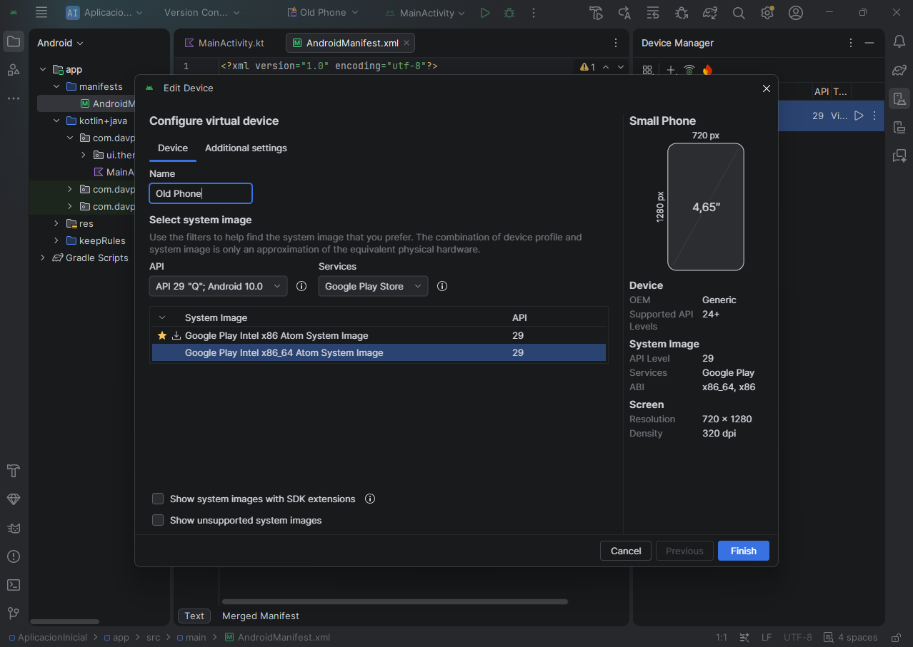
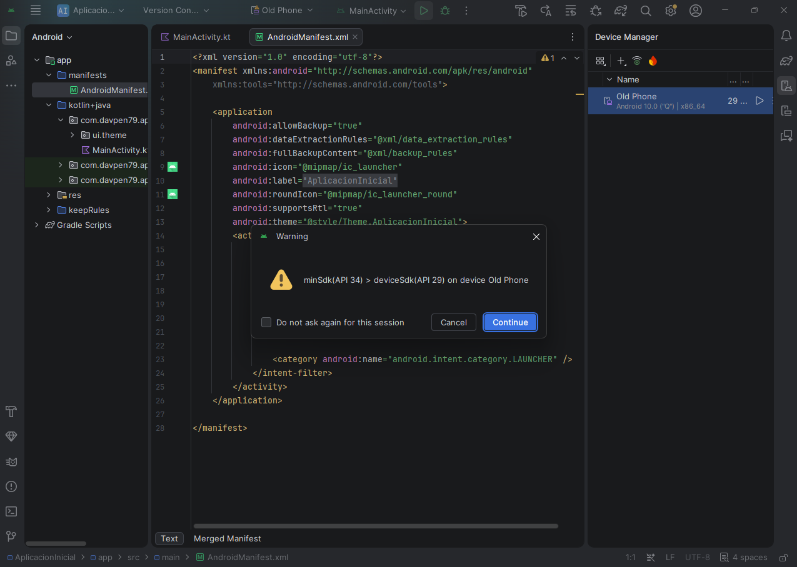
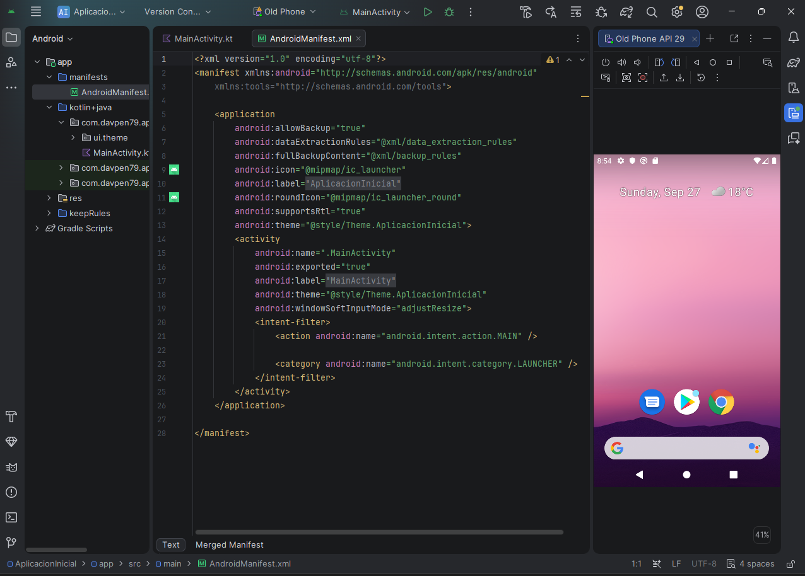
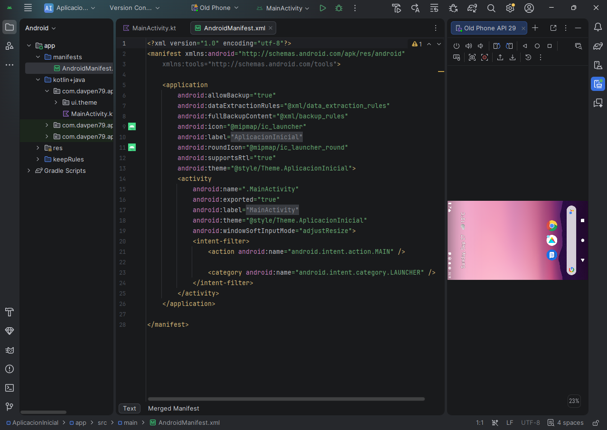
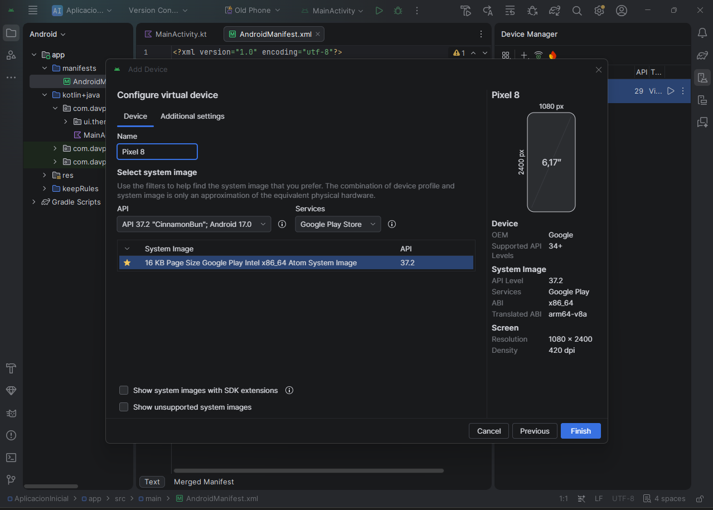
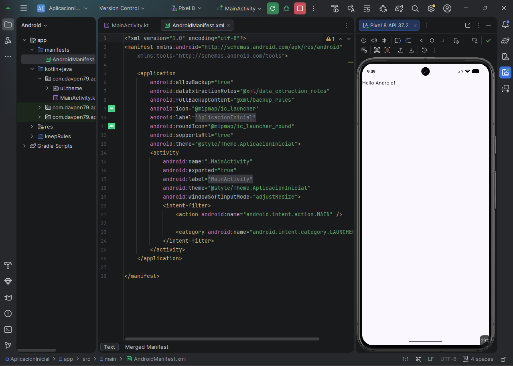
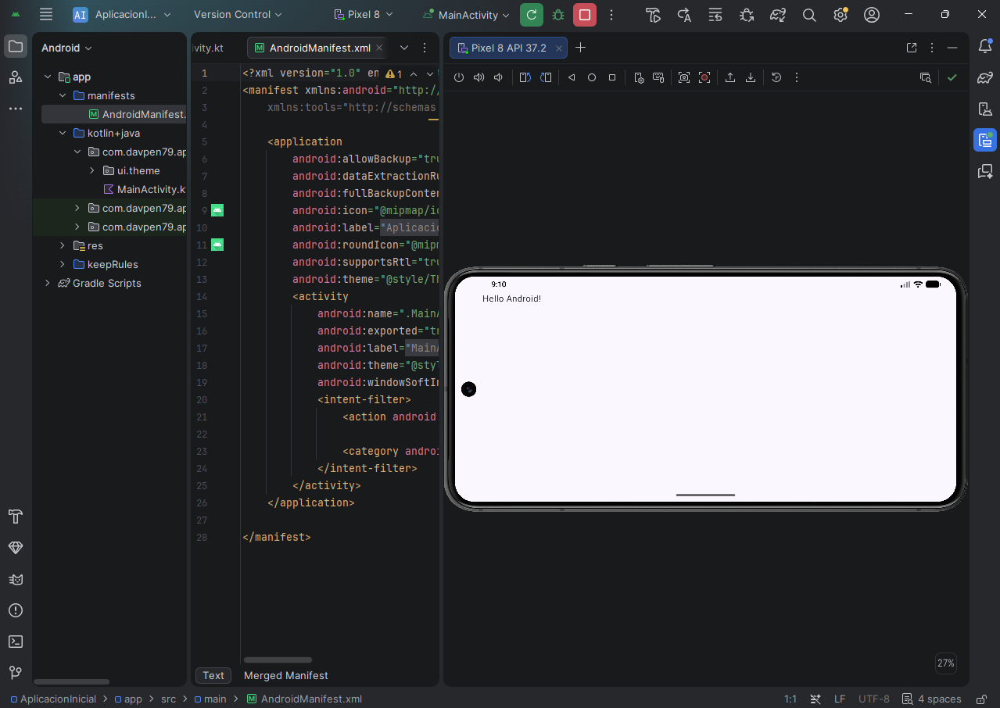
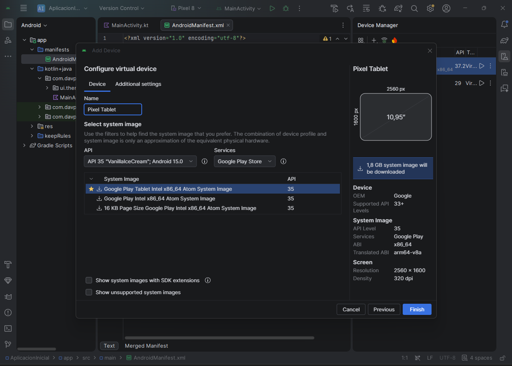
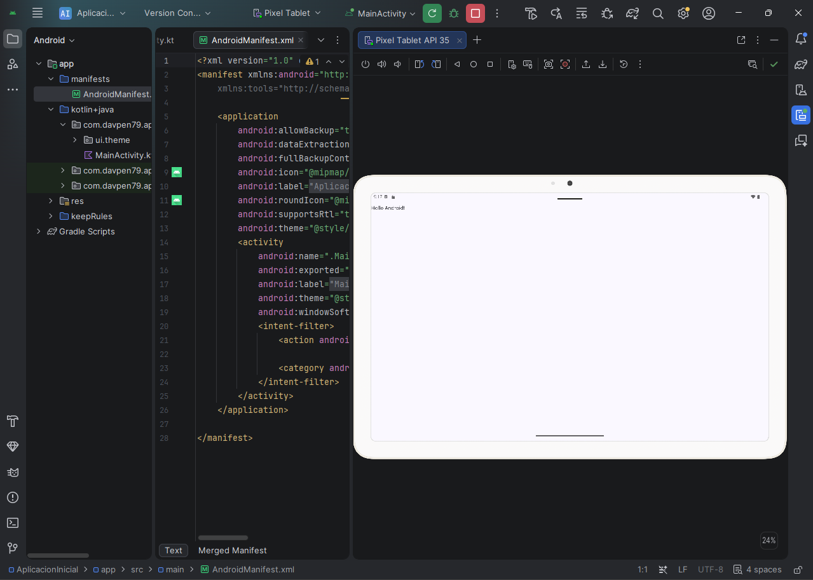
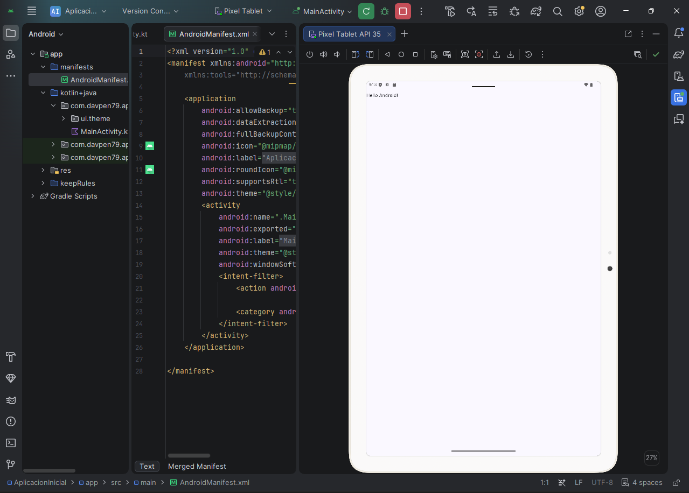

# A1.2 · Puesta en marcha del entorno

## Capturas de Movil Antiguo

## Capturas de Movil Moderno

## Capturas de Tablet

## OBSERVACIONES

- La aplicacion no se pudo ejecutar en el movil antiguo porque el API
  no estaba soportado. Es algo a tener en cuenta al desarrollar una aplicacion.
- Tanto en el movil moderno como en la tablet la aplicacion funcionó sin problemas.
- En todos los casos la composicion de pantalla al rotar el dispositivo se adapta correctamente.
