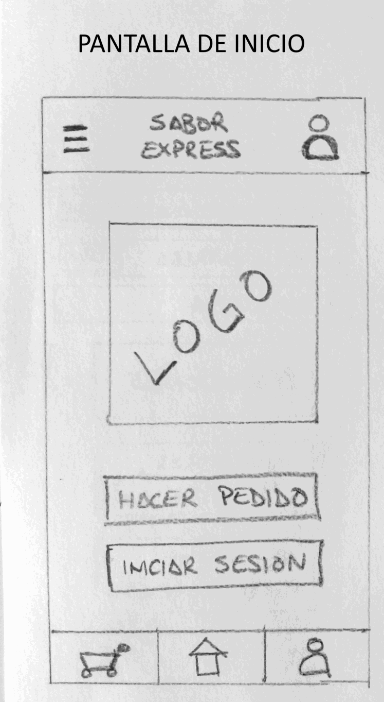
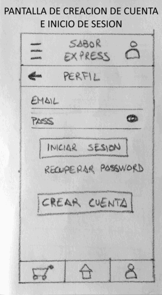
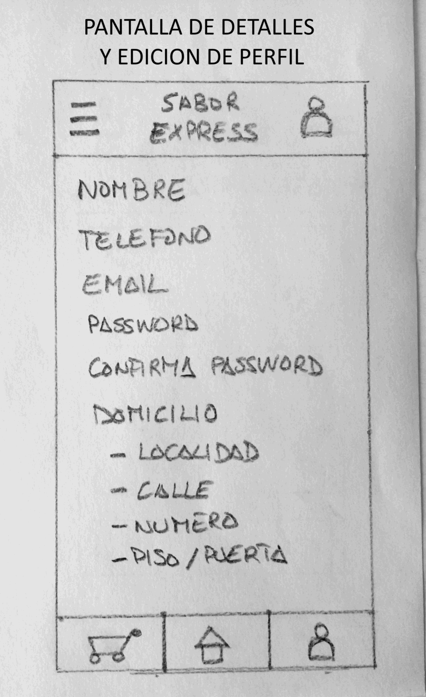
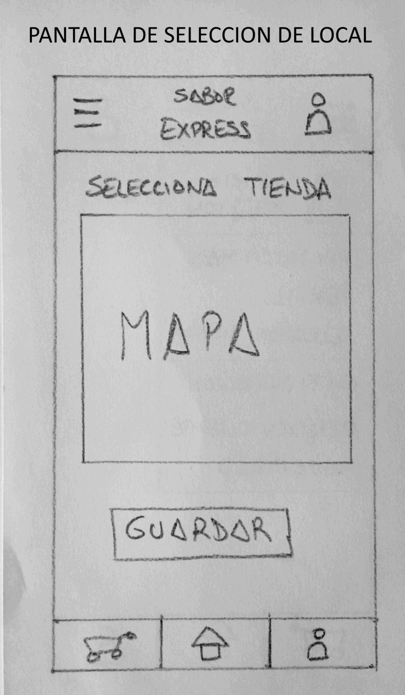
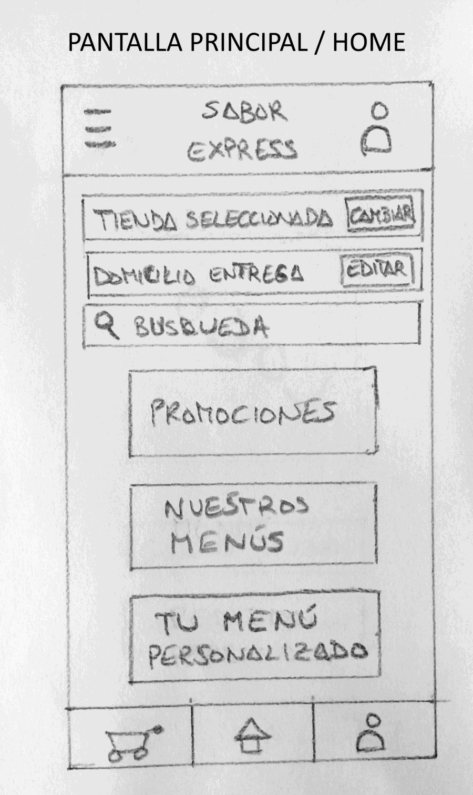
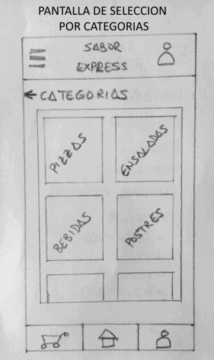
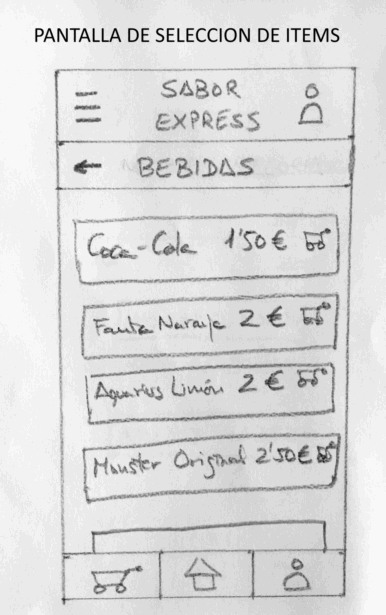
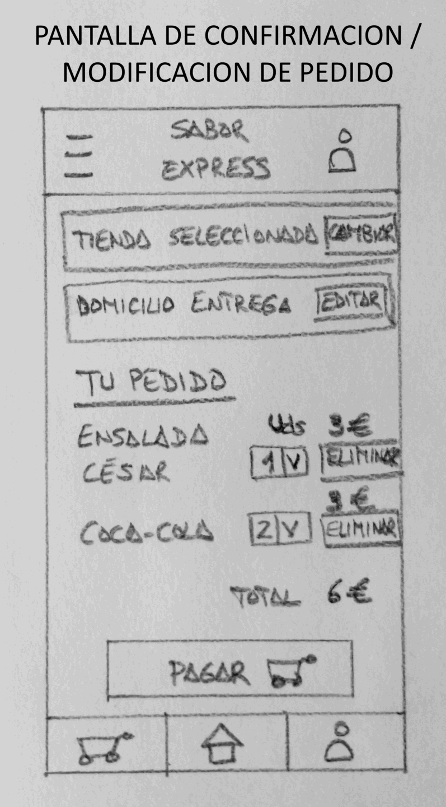
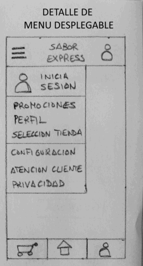
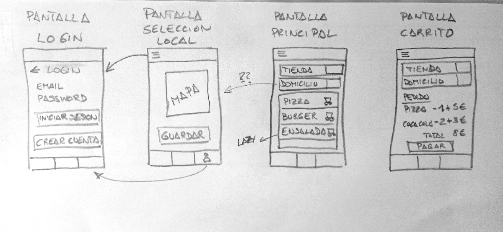

# Plantilla: propuesta del Proyecto A

---

## 0 · Datos

| | |
|---|---|
| **Nombre de la app** | SaborExpress |
| **Autor/a** | David Pena Fernandez |
| **Fecha** | 23/09/2026 |

---

## 1 · La idea en una frase

> Qué hace tu app y para quién, en una sola frase.
>
> Fórmula: «Una app que permite a [quién] hacer [qué] para [para qué].»

Una aplicación que permite a trabajadores con horarios apretados buscar y consultar el menú
de una pequeña cadena de restaurantes para realizar pedidos de comida a domicilio.

---

## 2 · El problema

> ¿Qué problema resuelve? ¿Cómo se resuelve hoy sin tu app?

Hay muchas personas que trabajan lejos de sus casas y tienen largas jornadas de trabajo.
Como consecuencia no tienen tiempo para hacer la compra ni para hacer la comida/cena.
Una manera de resolver el problema es solicitar comida a domicilio a cadenas de comida rápida,
o a través de apps de móvil. Mi aplicación intenta ofrecer ese servicio para una cadena de restaurantes
de proximidad.

---

## 3 · Personas usuarias

> ¿Quién la va a usar? Describe a una persona concreta: edad, soltura con la
> tecnología, cuándo y dónde abre la app, cuánto tiempo le dedica y qué pasa
> si le falla.

Mi usuario objetivo es un hombre o mujer adulto, trabajador por cuenta ajena que trabaja lejos de su domicilio.
Se le presupone un conocimiento básico (no avanzado) del uso de aplicaciones móviles. Usará la aplicación al llegar a
su casa después del trabajo. El tiempo de uso de la aplicación es puntual y de corta duración. Si la aplicación falla o
el servicio no está disponible el usuario debe gastar su tiempo en hacerse su comida/cena o solicitar otro servicio de comida
a domicilio (cadena de fast-food, food delivery, etc)

---

## 4 · Funcionalidades

### Imprescindibles (sin esto la app no tiene sentido)

| #  | Funcionalidad                           |
|----|-----------------------------------------|
| F1 | Busqueda/Selección de local más cercano |
| F2 | Consulta de comidas disponibles         |
| F3 | Selección de platos que solicitas       |
| F4 | Creacion de pedido                      |
| F5 | Creacion de perfiles de usuario         |

### Opcionales (si sobra tiempo)

| #  | Funcionalidad |
|----|---------------|
| O1 | Gestión de pagos |
| O2 | Creación de sistema de reseñas / recomendaciones |

---

## 5 · Pantallas

| Pantalla                               | Para qué sirve                             | Se llega desde                   |
|----------------------------------------|--------------------------------------------|----------------------------------|
| Pantalla de Acceso/Registro de usuario | Inicio sesion/Registro de usuario          | Inicio/Menú desplegable/boton    |
| Pantalla de seleccion de local         | Selección del local al que hacer el pedido | Menú desplegable/boton           |
| Pantalla Principal / Lista de platos   | Consulta y selección de platos a pedir     | Menú desplegable/boton (Home)    |
| Pantalla de pedido                     | Revisar y confirmar el pedido              | Menú desplegable/boton (Carrito) |

---

## 6 · Bocetos

> Dibuja las pantallas principales. A mano y fotografiado es válido.
> Pega aquí las imágenes o indica el nombre de los archivos adjuntos.
 
 
 
 

---

## 7 · Qué datos guarda la app

| Tipo de dato | Campos | Ejemplo |
|--------------|--------|---------|
| Comida | Nombre, precio | "Pizza Tropical", 10€ |
| Direccion de entrega | Calle, numero, piso | Camelias, 22, 3º |
| Telefono cliente | telefono | 678123456 |
| Nombre cliente | Nombre | Luis |

---

## 8 · Encaje con los requisitos del módulo

> Apartado obligatorio: ninguna casilla puede quedar vacía.

| Requisito | Dónde encaja en tu app                                                            | Tema |
|-----------|-----------------------------------------------------------------------------------|------|
| **Persistencia de datos** — la información sobrevive al cerrar la app | La lista de comidas se guardará mediante la API que nos proporcionará el profesor | 4 |
| **Servicio web** — la app consulta datos por internet | La aplicacion consultará las comidas guardadas con la API que nos da el profesor  | 5 |
| **Sensor o localización** | Mapa de localización de locales                                                   | 6 |
| **Contenido multimedia** — foto, audio, vídeo o animación | Imagenes de platos                                                                | 7 |

---

## 9 · Riesgos

| Lo que me preocupa                                                   | Plan B                                   |
|----------------------------------------------------------------------|------------------------------------------|
| Complejidad de implementacion de un sistema de pagos                 | Funcionalidad Opcional(no se implementa) |
| Demasiadas pantallas que implementar para una funcionalidad completa | Simplificar / Reducir Funciones          |

---

## Antes de entregar

- [ ] La idea cabe en una frase.
- [ ] El público es una persona concreta, no «todo el mundo».
- [ ] Hay **3 o 4** funcionalidades imprescindibles, no diez.
- [ ] Cada funcionalidad imprescindible tiene su pantalla.
- [ ] Hay bocetos de las pantallas principales.
- [ ] **Las cuatro casillas del apartado 8 están rellenas.**
- [ ] Está identificado al menos un riesgo con su plan B.
